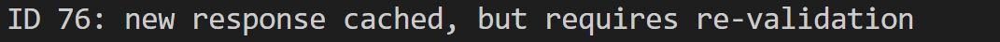

# Proxy 

A c++ based proxy writeen by purmecia

## Run proxy
We have daemonized our proxy, so you can either run
```
$: docker-compose up -d
```
to run the proxy as daemon. Or you can run
```
$: make -B proxy
$: ./
```
to simply run the proxy as server.

## Design proxy

### Concurrency
Everytime proxy receives a new request, it spawns a new thread to handle the request. We all use a thread to clean the out-dated cache every 60s.

### Synchronization
All clients share and use the same cache. We hash request url, then mod the value with 30. Therefore, each request corresponds to one of 30 locks in cache_mutex. This avoids lock and wait for every http request.

For the synchronization of log output, as std::out is not thread safe,we will first send the whole output to a stringstream, then output it.

### C++ style
For handling new requests, we create a thread for each new request, and assign a unique_ptr to it. We use a vector to store all the unique_ptr.

In our code, we used a lot of try catch to handle possible exceptions. If it is the client reason, the code will throw a `ClientConnectionException`. Otherwise, it will throw a `ServerConnectionException`. For the first condition, the proxy will return 400, and for the second condition, it will return 502.


## Test proxy
In this section, we will show how we testd our proxy regarding different requirement. We also contain expected results for reference.

### Basic method

1. `GET`: To test get, we visited [ http://httpbin.org/get](http://httpbin.org/get) from web browser. It will show the page correctly, and the log is also correct.

2. `POST`: To test post, we visited [http://httpbin.org/forms/post](http://httpbin.org/forms/post) from web browser. It will show the page correctly, and the log is also correct.

3. `CONNECT`: To test post, we visited [https//www.google.com/](https//www.google.com/) from web browser. It will show the page correctly, and the log is also correct.

4. `Chunked transfer encoding`: To test post, we visited [http://www.httpwatch.com/httpgallery/chunked/chunkedimage.aspx
](http://www.httpwatch.com/httpgallery/chunked/chunkedimage.aspx
) from web browser. It will show the picture correctly, and the log is also correct.

### Cache control header
We implemented support for both *Response* and *Request*. To test it, we used Flask to create a back server, and visit the related address through netcat in another VM.

Under `test_programs` folder, we provided several programs which can be used to test our proxy. They are:

- test_cache_control.py<br>used for testing response cache-control header. For testing, we can change the cache-control value in the program to test different scenarios.
- test_expired.py<br>used for testing expired response, can be used to test request cache-control 
- test_revalidate.py<br>send re-validation request, if match, receive 304 reply
- test_revalidate_update.py<br>send re-validation request, receive a 200 reply, we should update cached


#### Basic cache control

We will show the test result for different cache control conditions

1. Not in cache <br>
    -  In cache, need revalidation<br>
    -  In cache, will expire<br>

2. In cache
    - In cache, valid <br>
    - In cache, but expired<br>
    - In cache, but need revalidation<br>
        - Updated<br><br>
        - Not modified<br>


#### Response cache control
>NOTE: During test, it is found that when visiting an address from web browser, it will automatically add “Cache-Control: max-age=0” , so the browser may ask for revalidate, even though the cached response is not exipired. Therefore, it is suggested to use netcat to test the proxy as simple request below.

Simple request: `printf "GET http://152.3.77.44:5000/ HTTP/1.1\r\nHost: 152.3.77.44\r\nContent-Type: application/json\r\n\r\n" | nc -N vcm-31165.vm.duke.edu 8080`

Fow different ip address, it should be updated following  `printf "GET http://{ip addr}:{ip port}/ HTTP/1.1\r\nHost: {ip addr}\r\nContent-Type: application/json\r\n\r\n" | nc -N {proxy addr} {proxy port}`

Feel free to change the Cache-Control header part in test_cache_control.py to test response cache control. They will fit into the above conditions.


#### Request cache control

To test the request cache control header, one of the best way is to let server respond a possible expired response, and test the output in these conditions. We add the cache-control header in the simple request in the response cache control part. We can simply run the request twice to test. 

Cache control request: `printf "GET http://{ip addr}:{ip port}/ HTTP/1.1\r\nHost: {ip addr}\r\nContent-Type: application/json\r\nCache-Control: {info}\r\n\r\n" | nc -N {proxy addr} {proxy port}`


>Note: In the test_expired.py the expire time is set to be 10s & out-dated cache will be cleaned every 60s

Will show the command we used to test different Cache-control header of request, and the result.

- Test no store
```
printf "GET http://152.3.77.44:5000/ HTTP/1.1\r\nHost: 152.3.77.44\r\nContent-Type: application/json\r\nCache-Control: no-store\r\n\r\n" | nc -N vcm-31165.vm.duke.edu 8080
```

- Test no-cache
```
printf "GET http://152.3.77.44:5000/ HTTP/1.1\r\nHost: 152.3.77.44\r\nContent-Type: application/json\r\nCache-Control: no-cache\r\n\r\n" | nc -N vcm-31165.vm.duke.edu 8080
```

- Test max-age
```
printf "GET http://152.3.77.44:5000/ HTTP/1.1\r\nHost: 152.3.77.44\r\nContent-Type: application/json\r\nCache-Control: max-age=2\r\n\r\n" | nc -N vcm-31165.vm.duke.edu 8080
```

- Test max-stale
```
printf "GET http://152.3.77.44:5000/ HTTP/1.1\r\nHost: 152.3.77.44\r\nContent-Type: application/json\r\nCache-Control: max-stale=50\r\n\r\n" | nc -N vcm-31165.vm.duke.edu 8080
```

- Test min-fresh
```
printf "GET http://152.3.77.44:5000/ HTTP/1.1\r\nHost: 152.3.77.44\r\nContent-Type: application/json\r\nCache-Control: min-fresh=50\r\n\r\n" | nc -N vcm-31165.vm.duke.edu 8080
```


### Malformed request and response
#### Malformed request
To test malformed request, we create a POST request, whose content length is smaller than its body. The client will receive 400 then.

```
printf "POST www.baidu.com HTTP/1.1\r\nHost: baidu.com\r\nContent-Type: application/json\r\nContent-Length: 1\r\n\r\n{abc}" | nc -N vcm-31165.vm.duke.edu 8080
```

The result is as 

#### Malformed response

To create a malformed response, we create a response whose header is lacking of value in test_malform_response.by by using http. When visit the link as a simple request, the client will receive 502 then.


### Clean cache

In our implementation, out-dated cache will be cleaned every 60s by a thread. The output is as below.
